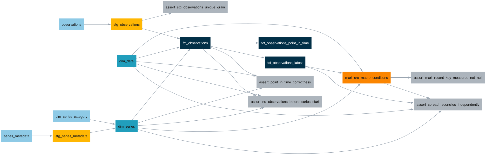

# bridge-pipeline


A dimensional data warehouse for commercial real estate credit conditions: 17 curated
[FRED](https://fred.stlouisfed.org/)/[ALFRED](https://alfred.stlouisfed.org/) macro series —
the Treasury curve, inflation, labor, commercial property prices, and bank lending
standards — ingested with full revision history, modeled in dbt as a proper star schema, and
served through a headline mart built to answer "what were macro conditions for CRE credit at a
given point in time." Runs on Snowflake; also runs entirely on DuckDB with no cloud account,
so anyone cloning this repo gets a working build in [under five minutes](#quickstart-duckdb-no-account-needed).
A small read-only [REST API](#api) sits on top of the marts for querying the warehouse
programmatically, including point-in-time lookups against an arbitrary past date.

## Architecture

```
FRED / ALFRED API
       |
       v
Python ingest (ingest/pipeline_snowflake.py) -- full vintage history, idempotent MERGE
       |
       v
RAW  (Snowflake, or a seeded DuckDB fixture)
       |
       v
dbt staging  (stg_observations, stg_series_metadata -- rename, cast, nothing else)
       |
       v
dbt marts    (star schema)

    dim_series ----\
                     >---  fct_observations  (one row per series / date / vintage)
    dim_date ------/              |
                                   |---> fct_observations_latest        (today's best-known view)
                                   |---> fct_observations_point_in_time (as-of an arbitrary date)
                                   |
                                   v
                        mart_cre_macro_conditions
                        (one row per month, wide, with derived measures)
```

A small [FastAPI service](#api) (`api/`) reads dim_series, fct_observations_latest, and
fct_observations_point_in_time directly -- a read-only query layer over the same DuckDB
(or Snowflake) file, not a separate pipeline.

Full lineage graph, generated straight from the dbt DAG:



### Orchestration

`orchestration/` runs both pipelines above under a local Airflow instance (LocalExecutor,
TaskFlow `@dag`/`@task`, Docker Compose) instead of leaving them triggered by hand:

```
legacy_postgres_pipeline   extract -> quality_gate -> load           (FRED DGS10 -> Postgres)
snowflake_dbt_pipeline     ingest_series -> dbt_build                (FRED/ALFRED -> Snowflake RAW -> marts)
```

```bash
make airflow-up    # http://localhost:8080 (admin/admin)
make dag-test       # DagBag import + task-structure checks, run inside the Airflow container
```

Retries with exponential backoff are on the FRED-API extract task specifically (the flakiest
step in either DAG), each DAG has a structured on-failure callback, and reruns/backfills are
idempotent by construction — see [`DECISIONS.md`](DECISIONS.md#phase-8-orchestration) for why,
and for why the live GCE cron entry (below) stays untouched rather than being pointed here.

### Why this shape

- **Vintages, not just current values.** FRED/ALFRED data gets revised — a monthly CPI print
  is republished repeatedly as more source data comes in. `fct_observations` keeps every
  revision as its own row, so `fct_observations_point_in_time` can answer "what did we
  believe this number was, as of some date in the past" — not just "what is it now." This is
  the core modeling problem the project is built to demonstrate; see
  [`DECISIONS.md`](DECISIONS.md) for the full SCD Type 2 writeup, including a real API
  constraint that shaped the design (FRED periodically re-stamps an entire daily series'
  history even when no value changed — full vintage tracking is scoped to the 10 series
  where it's economically meaningful, not all 17).
- **A legacy path still runs alongside it.** The original version of this repo ingested one
  FRED series into Postgres — see [Legacy path](#legacy-path-postgres--gce) below. It's kept
  running, not replaced in one pass, per this rebuild's own ground rules.

## Quickstart (DuckDB, no account needed)

Verified end to end from a clean environment — clone to a fully green `dbt build` in about
3 minutes:

```bash
git clone https://github.com/ZacharyChai/bridge-pipeline.git
cd bridge-pipeline
python3.13 -m venv .venv
.venv/bin/pip install -r requirements.txt -r requirements-dev.txt
.venv/bin/dbt deps --project-dir dbt --profiles-dir dbt
make dbt-build              # seeds a real ~4-year FRED/ALFRED fixture into DuckDB, then
                             # builds and tests every model — 80 tests, all green
```

Then explore the warehouse, or the models themselves:

```bash
make dbt-docs                # generate + serve dbt docs locally, with the lineage graph
```

The DuckDB seed data (`dbt/seeds/*.csv`) is a real, trimmed snapshot from a live FRED/ALFRED
pull — not synthetic — regenerated with `scripts/generate_dbt_seeds.py`. It includes at least
one genuine revision (a `COMREPUSQ159N` reading that really changed across two vintages),
because the point-in-time logic is tested against it.

### Point-in-time queries

```bash
# What did the mart look like as of an arbitrary past date?
.venv/bin/dbt build --select fct_observations_point_in_time \
  --project-dir dbt --profiles-dir dbt --vars '{as_of_date: 2023-09-01}'
```

### Against Snowflake instead

```bash
cp .env.example .env    # fill in FRED_API_KEY, SNOWFLAKE_ACCOUNT/USER/PASSWORD
make dbt-debug TARGET=snowflake
make dbt-build TARGET=snowflake
```

`infra/snowflake_setup.sql` provisions the account objects (an XS warehouse with
`AUTO_SUSPEND=60`, `RAW`/`STAGING`/`MARTS` schemas, a dedicated `BRIDGE_DBT_ROLE`/
`BRIDGE_DBT_USER` — dbt never connects as your own login). `ingest/pipeline_snowflake.py`
populates `RAW` with full history; the DuckDB seeds above are a fixture, not something you
run against Snowflake (`dbt seed`'s raw-table targets are disabled there — see
[`DECISIONS.md`](DECISIONS.md)).

## Stack

Python 3.13 · dbt-core + dbt-snowflake + dbt-duckdb · Snowflake · DuckDB · dbt_utils ·
dbt-expectations · Airflow (LocalExecutor, TaskFlow API) · FastAPI + uvicorn · sqlfluff ·
pytest · ruff · GitHub Actions · Postgres 16 (legacy path) · Docker · Terraform · cron ·
Uptime Kuma.

## Testing & CI

```bash
make test              # pytest — unit tests need no DB; integration suites (Postgres,
                        # Snowflake, and the API) all skip gracefully if unreachable
make lint               # ruff check + format
make sqlfluff-lint       # SQL lint, Snowflake dialect
make dbt-build           # dbt build (all tests) — duckdb by default, TARGET=snowflake to switch
```

80 dbt tests, 40+ over the project's own bar: generic tests (`not_null`/`unique`/
`accepted_values`/`relationships`) on every model, `dbt-expectations` distributional bounds on
every mart measure, and 5 singular tests covering real business logic — including one that
proves point-in-time correctness against a genuine FRED revision, and one that reconciles the
mart's headline spread against an independent recomputation from the base fact. Test severity
is deliberate, not left at the default: a handful of distributional bounds and one
recent-data-freshness check are `warn`, not `error` — see [`DECISIONS.md`](DECISIONS.md) for
which, and why (short version: two of those warnings have already fired for real, on the 2020
COVID labor-market shock, exactly as intended — a genuine historical extreme, correctly
flagged, not blocking the build).

GitHub Actions runs ruff, sqlfluff, the full pytest suite (against a real Postgres service
container), `dbt build` + `dbt source freshness` against an isolated Snowflake schema —
created and torn down per pull request — and a DAG-integrity job (both DAGs import cleanly,
have the expected tasks, retries, and failure callback) on every PR. See
[`.github/workflows/ci.yml`](.github/workflows/ci.yml).

## API

A small, read-only FastAPI service (`api/`) over the same warehouse — for a recruiter or
interviewer to poke at with `curl` or `/docs`, not a second system of record. It queries
`dim_series`, `fct_observations_latest`, and `fct_observations_point_in_time` directly
against whichever DuckDB (or Snowflake) file `make dbt-build` last produced; it writes
nothing.

```bash
make dbt-build          # first, so bridge.duckdb actually has data
make api-run             # http://localhost:8000/docs (interactive Swagger UI)
```

| Endpoint | What it returns |
|---|---|
| `GET /series` | The 17-series catalog (`?category=` to filter) |
| `GET /series/{series_id}` | One series' metadata, 404 if unknown |
| `GET /series/{series_id}/observations` | Best-known values, `?start_date=`/`?end_date=` |
| `GET /series/{series_id}/observations/as-of` | Point-in-time reconstruction as of `?as_of_date=` |
| `GET /health` | Liveness check against the DuckDB/Snowflake connection |

The `as-of` endpoint is the one worth reading the code for: `fct_observations_point_in_time`
(the dbt view) always answers "as of right now," because `current_date` there is a SQL
function evaluated at query time, not the compile-time `as_of_date` dbt var — so the API
re-derives that model's row-ranking logic directly against `fct_observations` (the fact
table that keeps every revision) with the caller's date substituted in. See
[`DECISIONS.md`](DECISIONS.md#phase-9-rest-api) for the full writeup, including why this
queries DuckDB directly instead of adding a third SQLAlchemy engine alongside `db.py` and
`db_snowflake.py`.

```bash
make api-test            # 12 integration tests against a real bridge.duckdb build
```

Not yet wired into `.github/workflows/ci.yml` — CI covers the dbt/Postgres/Snowflake paths
described above; the API tests currently run locally only.

## Documentation

Full dbt docs (every model, every column, the interactive lineage graph) generate in CI on
every merge to `main` and publish to GitHub Pages:
**https://zacharychai.github.io/bridge-pipeline/**

Locally: `make dbt-docs`.

[`DECISIONS.md`](DECISIONS.md) is the project's full design log — grain statements, the
SCD Type 2 approach and what was rejected, surrogate key strategy, every non-obvious choice
and why, organized by phase. [`INTERVIEW_NOTES.md`](INTERVIEW_NOTES.md) is the short,
spoken-register companion: the three hardest problems and how they got solved, likely
interviewer questions with answers, and an honest list of what this project doesn't do.

## Legacy path: Postgres + GCE

The original version of this project ingested one FRED series (`DGS10`, current values only)
into Postgres, containerized, and deployed continuously to a hardened GCE VM. That path is
kept running, not deleted in one pass — it still pulls fresh data daily, on the same GCE cron
entry it always has ([`deploy/bridge-pipeline.cron`](deploy/bridge-pipeline.cron)). The local
Airflow instance (above) runs the same `extract -> quality_gate -> load` sequence as a DAG for
demonstration, but doesn't control the live box — see
[`DECISIONS.md`](DECISIONS.md#phase-8-orchestration) for why that cron entry stays put.

- **Provisioning** ([`infra/`](infra/)) — Terraform stands up the VM (SSH-only firewall,
  key-only auth, non-root deploy user).
- **Continuous delivery** ([`deploy/`](deploy/)) — every merge to `main` builds the image,
  pushes to GHCR, deploys over SSH.
- **Monitoring & backup** — Uptime Kuma heartbeats; nightly `pg_dump` with a verified restore
  path.
- **Legacy pipeline code**: `ingest/pipeline.py`, `ingest/fred.py`'s original
  `fetch_observations`, `transform/`, `db.py`.

Full runbooks: [`infra/README.md`](infra/README.md) · [`deploy/README.md`](deploy/README.md).
Local dev instructions for this path: [`SETUP.md`](SETUP.md).

## Project status

| Phase | Status |
|---|---|
| M0-M6 — original Postgres/GCE pipeline (see [Legacy path](#legacy-path-postgres--gce)) | done |
| Phase 0 — audit and baseline ([`AUDIT.md`](AUDIT.md)) | done |
| Phase 1 — Snowflake + DuckDB fallback | done |
| Phase 2 — ALFRED vintage ingest into Snowflake RAW | done |
| Phase 3 — staging layer | done |
| Phase 4 — dimensional marts, SCD Type 2 | done |
| Phase 5 — testing and data quality | done |
| Phase 6 — CI and documentation | done |
| Phase 7 — decisions record ([`DECISIONS.md`](DECISIONS.md)), interview notes ([`INTERVIEW_NOTES.md`](INTERVIEW_NOTES.md)) | done |
| Phase 8 — Airflow orchestration ([`orchestration/`](orchestration/)) | done |
| Phase 9 — [REST API](#api) (`api/`) | done |

## Repository layout

```
api/                              Phase 9: read-only FastAPI service over the marts
  main.py                          routes
  db.py                            DuckDB connection (read-only, request-scoped)
  schemas.py                       pydantic response models
ingest/                          FRED/ALFRED ingest
  fred.py                          HTTP client — legacy single-series + Phase 2 vintage-aware fetch
  series.py                        curated 17-series catalog
  pipeline.py                      legacy pipeline (Postgres, single series)
  pipeline_snowflake.py            current pipeline (Snowflake RAW, full vintage history)
db.py, db_snowflake.py           warehouse access — legacy Postgres / current Snowflake RAW
config.py                        typed settings from env / .env
dbt/                              dbt project
  models/staging/                  stg_ models — rename, cast, nothing else
  models/marts/                    dim_/fct_/mart_ — the dimensional model
  seeds/                           DuckDB fixture data (real, trimmed FRED/ALFRED snapshot)
  tests/                           singular tests — business logic, not schema
  macros/                          generate_schema_name override
orchestration/                    local Airflow (LocalExecutor) -- both pipelines' DAGs
  dags/                             legacy_postgres_pipeline.py, snowflake_dbt_pipeline.py
  tests/                            DAG-integrity checks (DagBag, run inside the container)
  docker-compose.yaml, Dockerfile   adapted from Airflow's official compose -- see DECISIONS.md
infra/                            Terraform (legacy GCE) + snowflake_setup.sql
deploy/                           legacy CD scripts, prod compose, cron, backup
scripts/                          generate_dbt_seeds.py, generate_lineage_graph.py, db-tunnel.sh
tests/                            pytest suite — ingest, transform, quality, both warehouses
docs/                             lineage.png
.github/                          CI workflow
AUDIT.md                          Phase 0 audit of the pre-rebuild repo
DECISIONS.md                      design decisions, by phase
INTERVIEW_NOTES.md                spoken-register companion to DECISIONS.md
Dockerfile, docker-compose.yml    legacy local dev image + stack
Makefile                          test/lint/dbt-*/sqlfluff-*/api-* targets
SETUP.md                          legacy local-dev setup walkthrough
```
